<picture>
  <source media="(prefers-color-scheme: dark)" srcset="assets/header-dark.svg">
  <source media="(prefers-color-scheme: light)" srcset="assets/header-light.svg">
  
</picture>

[**Portfolio**](https://matejejko.github.io) · [**LinkedIn**](https://sk.linkedin.com/in/matej-p-a2abb72b2) · [**Instagram**](https://instagram.com/matejejko)

 

<picture>
  <source media="(prefers-color-scheme: dark)" srcset="assets/terminal-dark.svg">
  <source media="(prefers-color-scheme: light)" srcset="assets/terminal-light.svg">
  
</picture>

## About

I took a slightly unusual route into tech — I started out studying hotel management before switching to computer science. Today I'm in a **dual education program** between **Deutsche Telekom** and **SPŠE Košice**: half academic theory, half hands-on work on real cloud infrastructure.

Away from work and school I daily-drive Arch-based Linux (CachyOS), run a small homelab, build web projects, and study Japanese.

## Current focus

- **Cloud infrastructure & Kubernetes** — deployments, Terraform and tooling as a DevOps intern
- **Self-hosting** — running and automating services on my own hardware
- **Web development** — building projects with JavaScript, HTML/CSS and Python

## Stack

<picture>
  <source media="(prefers-color-scheme: dark)" srcset="assets/stack-dark.svg">
  <source media="(prefers-color-scheme: light)" srcset="assets/stack-light.svg">
  
</picture>

## Pipeline

<picture>
  <source media="(prefers-color-scheme: dark)" srcset="assets/pipeline-dark.svg">
  <source media="(prefers-color-scheme: light)" srcset="assets/pipeline-light.svg">
  
</picture>

 

<picture>
  <source media="(prefers-color-scheme: dark)" srcset="assets/divider-dark.svg">
  <source media="(prefers-color-scheme: light)" srcset="assets/divider-light.svg">
  
</picture>

[Portfolio](https://matejejko.github.io) · [LinkedIn](https://sk.linkedin.com/in/matej-p-a2abb72b2) · [Instagram](https://instagram.com/matejejko)

