<picture>
  <source media="(prefers-color-scheme: dark)" srcset="assets/header-dark.svg">
  <source media="(prefers-color-scheme: light)" srcset="assets/header-light.svg">
  
</picture>

[**Portfolio**](https://matejejko.github.io) · [**LinkedIn**](https://sk.linkedin.com/in/matej-p-a2abb72b2) · [**Instagram**](https://instagram.com/matejejko)

 

<picture>
  <source media="(prefers-color-scheme: dark)" srcset="assets/terminal-dark.svg">
  <source media="(prefers-color-scheme: light)" srcset="assets/terminal-light.svg">
  
</picture>

## About

I took a slightly unusual route into tech — I started out studying hotel management before switching to computer science. Today I'm in a **dual education program** between **Deutsche Telekom** and **SPŠE Košice**: half academic theory, half hands-on work on real cloud infrastructure.

Away from work and school I daily-drive Arch-based Linux (CachyOS), run a small homelab, build web projects, and study Japanese.

## Current focus

- **Cloud infrastructure & Kubernetes** — deployments, Terraform and tooling as a DevOps intern
- **Self-hosting** — running and automating services on my own hardware
- **Web development** — building projects with JavaScript, HTML/CSS and Python

## Stack

| | |
|:--|:--|
| **Cloud & Infra** |     |
| **Systems** |     |
| **Languages** |     |
| **Tools** |    |

## GitHub activity

<picture>
  <source media="(prefers-color-scheme: dark)" srcset="https://github-readme-stats.vercel.app/api?username=matejejko&show_icons=true&include_all_commits=true&hide_border=true&bg_color=00000000&title_color=3fb950&icon_color=3fb950&text_color=8b949e&ring_color=3fb950">
  <source media="(prefers-color-scheme: light)" srcset="https://github-readme-stats.vercel.app/api?username=matejejko&show_icons=true&include_all_commits=true&hide_border=true&bg_color=00000000&title_color=1a7f37&icon_color=1a7f37&text_color=57606a&ring_color=1a7f37">
  
</picture>
&nbsp;
<picture>
  <source media="(prefers-color-scheme: dark)" srcset="https://github-readme-stats.vercel.app/api/top-langs/?username=matejejko&layout=compact&hide_border=true&bg_color=00000000&title_color=3fb950&text_color=8b949e">
  <source media="(prefers-color-scheme: light)" srcset="https://github-readme-stats.vercel.app/api/top-langs/?username=matejejko&layout=compact&hide_border=true&bg_color=00000000&title_color=1a7f37&text_color=57606a">
  
</picture>

 

<picture>
  <source media="(prefers-color-scheme: dark)" srcset="assets/footer-dark.svg">
  <source media="(prefers-color-scheme: light)" srcset="assets/footer-light.svg">
  
</picture>

